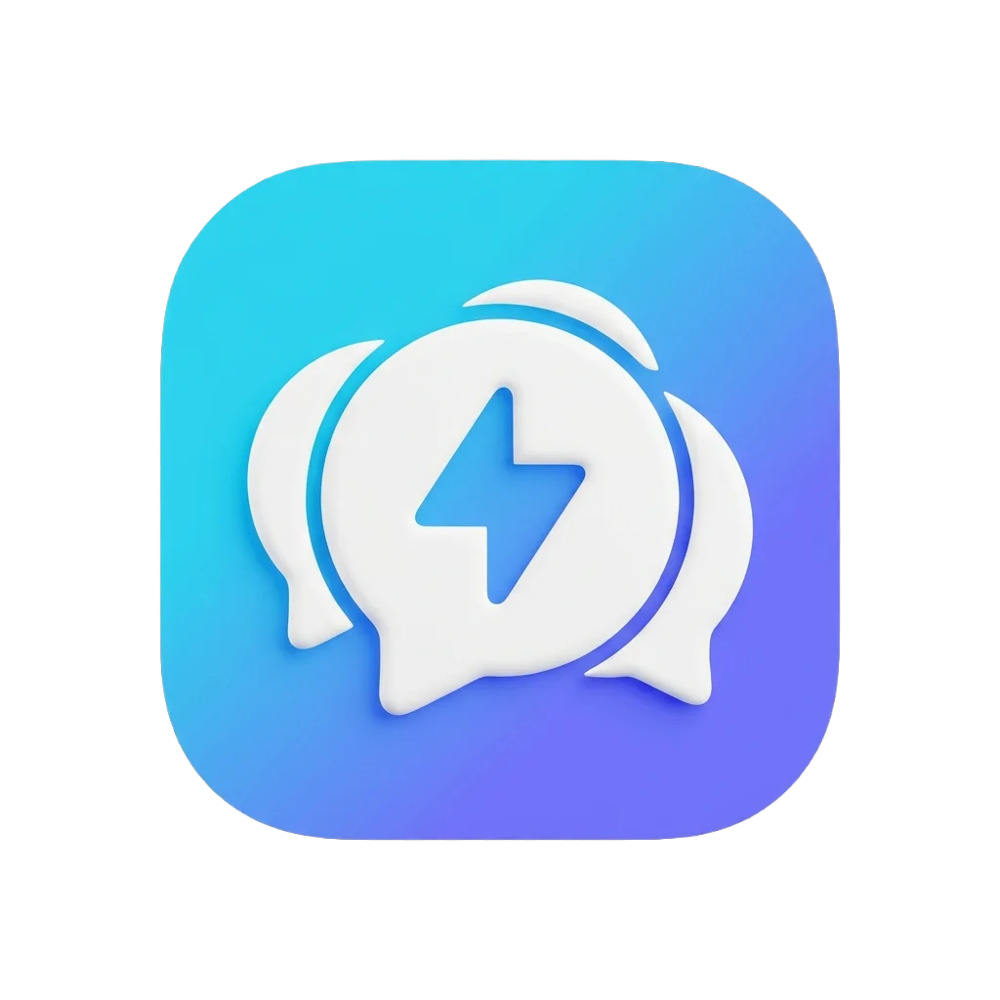
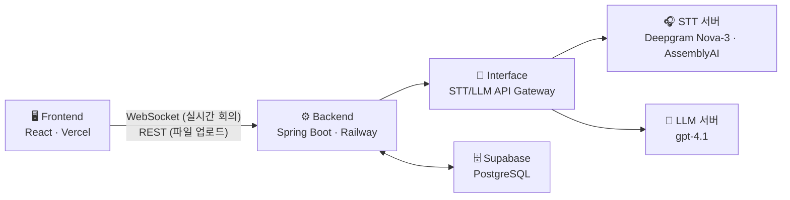
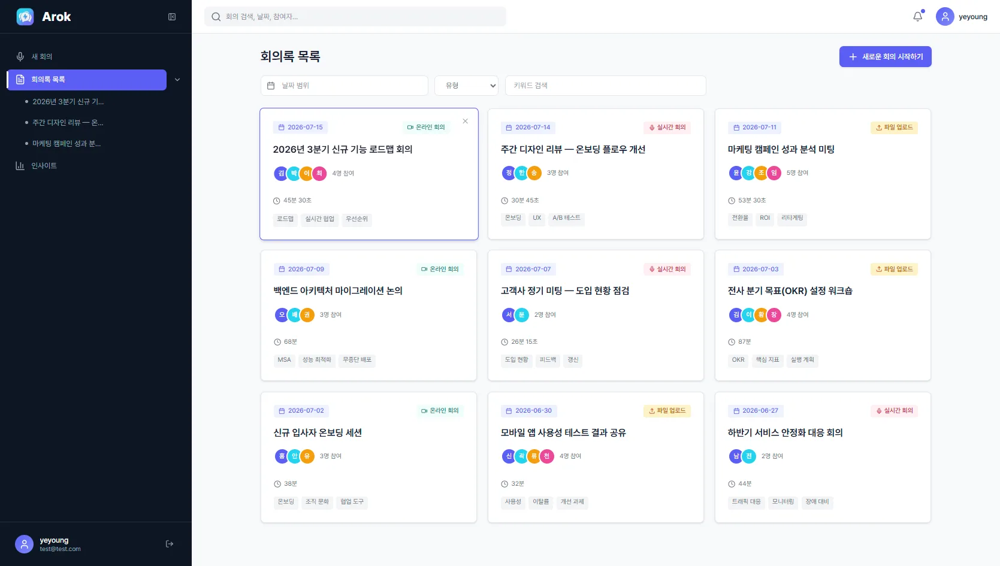
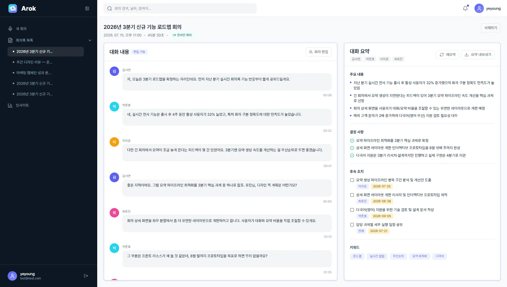
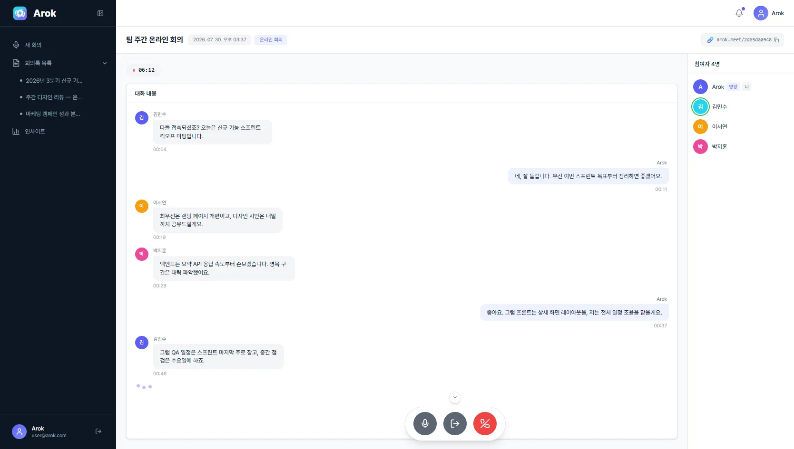
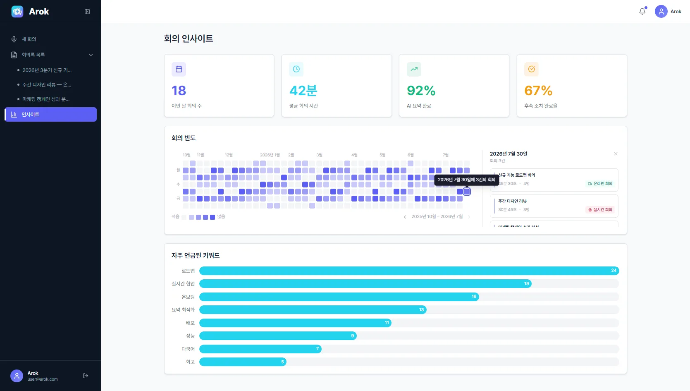

<div align="center">



# Arok

### AI 기반 회의록 자동화 시스템

회의실, 컨퍼런스 등 **다자간/정기 회의**를 위한 웹 기반 AI 회의록 시스템입니다.<br/>
음성인식(STT)으로 회의를 실시간 텍스트로 변환하고 LLM 요약을 결합해,<br/>
**기록에서 끝나지 않고 실제로 활용되는 회의록**을 만드는 것을 목표로 합니다.

<br/>

[](https://arok-frontend.vercel.app/)


</div>

<br/>

## 📌 프로젝트 소개

기존 음성인식 회의록 서비스는 대부분 **1인용 모바일·웹 앱** 중심으로 만들어져 있어, 특정 회의실에서 정기적으로 열리는 회의나 컨퍼런스처럼 **다자간·지속적인 회의**에는 활용도가 낮았습니다. 생성된 회의록도 실제 업무보다는 증빙 자료로만 남는 경우가 많아, 회의록보다 개인 메모가 더 유용해지는 아이러니한 상황이 반복됩니다.

Arok은 이 문제의식에서 출발해 ㈜넥타르소프트의 제안을 바탕으로 기획·개발한 **웹서비스 기반 AI 회의록 요약 시스템**입니다. Microsoft Work Trend Index(2023), Flowtrace State of Meetings Report(2025)에 따르면 팬데믹 이후 회의 시간은 약 3배 늘어 직장인이 연간 근무일의 약 1/5(약 49일)을 회의에 사용합니다. Arok은 이렇게 늘어난 회의 시간을 더 생산적으로 만드는 것을 목표로 합니다.

**프로젝트 특징**

- 1인용 서비스가 아닌 **다자간·정기 회의에 특화**된 웹 기반 회의록 시스템
- 단순 기록을 넘어 **LLM 기반 요약·지식 검색**을 결합해 회의록의 실질적 활용도 향상
- **실시간 온라인 회의 / 실시간 녹음 / 파일 업로드**, 3가지 회의 생성 방식 모두 지원
- 모드별로 지연시간·화자 분리 요구사항이 다르다는 점을 고려해 **모드별 최적 STT·LLM 모델 배치**
- STT의 partial(중간) 결과를 즉시 반영하는 **스트리밍 방식으로 체감 지연 개선**

<br/>

## 🏗️ 시스템 아키텍처



데이터는 `음성 → STT → 대화록 → 요약` 순서로 흐르고, DB에는 `audio_files → stt_results → transcripts → meeting_summaries` 순으로 적재됩니다. 사용자는 웹 UI에서 회의 모드를 선택해 회의를 생성하고, 실시간 자막과 종료 후 요약본을 한 화면에서 확인합니다.

- **실시간 회의(온라인·녹음)** — WebSocket으로 음성·자막 송수신
- **녹음 파일 업로드** — REST API로 비동기 처리

<br/>

## 🛠️ 기술 스택

| 구분         | 사용 기술                                                                    |
| :----------- | :--------------------------------------------------------------------------- |
| **Frontend** | React 19, TypeScript, Vite, Tailwind CSS v4, Zustand, React Router 7, Motion |
| **Backend**  | Spring Boot                                                                  |
| **Database** | Supabase (PostgreSQL) — `meetings` 중심 7개 테이블 설계                      |
| **AI**       | Deepgram Nova-3(+diarizer), AssemblyAI, gpt-4.1                              |
| **Realtime** | LiveKit Client, WebRTC, WebSocket STT                                        |
| **Deploy**   | Vercel (Frontend), Railway (Backend)                                         |
| **Design**   | Figma                                                                        |

<br/>

## ⭐ 핵심 기능 — 3가지 회의 방식

<table>
<tr>
<td width="33%" valign="top">

### 🔴 실시간 녹음

마이크를 통해 회의를 실시간으로 녹음하고 즉시 텍스트로 변환합니다. 회의가 진행되는 동안 대화 내용이 실시간으로 기록됩니다.

`실시간 전송` `화자 분리` `자동 저장`

</td>
<td width="33%" valign="top">

### 👥 온라인 그룹 회의

여러 참여자가 동시에 온라인으로 접속해 회의를 진행합니다. 방장이 종료하면 모든 참여자에게 회의록이 공유됩니다.

`다인 참여` `역할 구분` `실시간 공유`

</td>
<td width="33%" valign="top">

### 🎧 녹음 파일 업로드

이미 녹음된 오디오 파일을 업로드하면 AI가 자동으로 분석해 화자를 분리하고 회의록을 생성합니다.

`MP3/WAV 지원` `화자 식별` `배치 처리`

</td>
</tr>
</table>

<br/>

## 🚀 사용 흐름

```
  ① 회의 방식 선택  ┄┄▶  ② 회의 시작  ┄┄▶  ③ AI 요약 생성  ┄┄▶  ④ 확인 및 공유
```

|  단계  | 내용           | 설명                                                                 |
| :----: | :------------- | :------------------------------------------------------------------- |
| **01** | 회의 방식 선택 | 실시간 녹음, 그룹 회의, 파일 업로드 중 원하는 방식을 선택합니다.     |
| **02** | 회의 시작      | AI가 실시간으로 음성을 텍스트로 변환하고 화자를 자동으로 구분합니다. |
| **03** | AI 요약 생성   | 회의 종료 후 주요 내용, 결정 사항, 후속 조치를 자동으로 정리합니다.  |
| **04** | 확인 및 공유   | 생성된 회의록을 검토하고 팀과 공유하거나 문서로 내보냅니다.          |

<br/>

## 💻 주요 화면 소개

<table>
<tr>
<td width="50%" valign="top">

<br/><br/>

**회의록 관리 및 검색**

`날짜별 정렬` `키워드·유형 검색` `삭제`

</td>
<td width="50%" valign="top">

<br/><br/>

**AI 회의록 상세 보기**

`재요약` `파일 내보내기` `전문·화자 편집`

</td>
</tr>
<tr>
<td width="50%" valign="top">

<br/><br/>

**온라인 그룹 회의**

`실시간 STT 자막` `코드 참여` `종료 시 자동 공유`

</td>
<td width="50%" valign="top">

<br/><br/>

**회의 인사이트 분석**

`키워드 차트` `발언 분포` `기간별 통계`

</td>
</tr>
</table>

<br/>

## 🔍 기술 선정 근거

**음성인식(STT)** — 실시간 스트리밍 가능 여부, 화자 분리 필요성, 비용을 기준으로 Deepgram, gpt-4o-transcribe, AssemblyAI를 비교했습니다. 정확도는 세 모델이 비슷했지만 지연시간과 비용에서 차이가 있어, **실시간 온·오프라인 회의에는 Deepgram Nova-3(+diarizer)**, **녹음 파일 업로드에는 AssemblyAI**를 각각 적용했습니다.

**요약(LLM)** — gpt-4.1, gpt-4.1-mini, claude-sonnet, claude-haiku를 속도·비용·품질 기준으로 비교했습니다. 요약 품질은 gpt-4.1과 claude-sonnet이 모두 우수했으나, 속도를 최우선 기준으로 두어 **gpt-4.1을 최종 채택**했습니다.

**실시간 자막 UX** — 문장이 확정(final)될 때까지 기다렸다가 자막을 표시하면 발화 중 화면이 비어 체감 지연이 컸습니다. STT의 **partial(중간) 결과를 발화 즉시 화면에 반영**하고 문장이 확정되면 최종 텍스트로 자연스럽게 교체하는 방식으로, 라이브 캡션에 가까운 실시간성을 확보했습니다.

<br/>

## 👥 팀 구성

| 이름   | 담당 업무                         | GitHub                                                               |
| :----- | :-------------------------------- | :------------------------------------------------------------------- |
| 배율희 | ERD 설계 및 DB 구현               | [@baeyulhee](https://github.com/baeyulhee)                           |
| 이승현 | LLM 서버 및 요약 관련 백엔드 처리 | [@sihumji00](https://github.com/sihumji00)                           |
| 정용진 | STT 처리 및 백엔드 처리           | [@Youngyoung1](https://github.com/Youngyoung1)                       |
| 양예영 | UI/UX 디자인 및 프론트엔드 구현   | [@hs-2171117-yeyoungyang](https://github.com/hs-2171117-yeyoungyang) |
